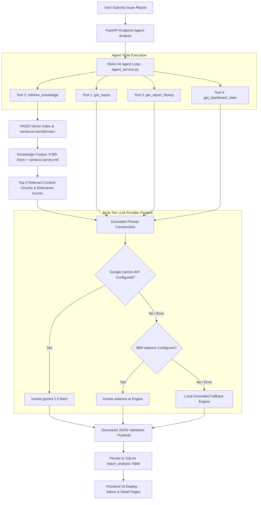

# AI & RAG Workflow Architecture — AI Sustainability Discovery

This document details the architecture, vector search pipeline, autonomous agent loop, multi-tier provider fallback, and prompt engineering strategies powering the **AI Sustainability Discovery Platform**.

---

## 🎯 Architecture Overview

The platform uses a hybrid AI architecture combining **Retrieval-Augmented Generation (RAG)** vector search with an **Autonomous ReAct AI Agent** framework.



---

## 🔍 1. RAG Vector Knowledge Engine (`rag_service.py`)

### Embedding Model & Vector Index
- **Embedding Model:** `sentence-transformers/all-MiniLM-L6-v2`
  - Generates 384-dimensional dense vector embeddings.
  - Normalized vectors enable fast cosine similarity calculation via Inner Product (`IP`).
- **Vector Index:** `faiss-cpu` (`faiss.IndexFlatIP(384)`)
  - In-memory vector store ensuring sub-10ms similarity search latency.
- **Chunking Strategy:**
  - Markdown documents are split into logical paragraphs/sections.
  - Each chunk maintains metadata: `filename`, `section_title`, and `text_content`.

### Knowledge Base Corpus (`Backend/data/knowledge/`)
The system indexes 9 domain-specific sustainability knowledge documents:

| Document | Primary Focus | Key Evidence / Guidelines |
|---|---|---|
| `campus-survey.md` | Campus Survey Observations | Respondent-reported issues on plastic, water leaks, food waste, HVAC |
| `sdg11.md` | Sustainable Cities (SDG 11) | Urban target benchmarks, waste management KPIs, community engagement |
| `waste-management.md` | Waste Management & Recycling | Segregation guidelines, organic composting, e-waste handling |
| `water-conservation.md` | Water Conservation & Leak Repair | Plumbing maintenance schedules, float valves, greywater reuse |
| `energy-efficiency.md` | Energy Efficiency & Smart Grids | LED retrofits, occupancy sensors, HVAC temperature setpoints |
| `air-quality.md` | Air Quality & Dust Suppression | Natural green bio-filters, anti-idling policies, AQI monitoring |
| `sustainable-cities.md` | Sustainable Mobility & Urban Planning | Pedestrian pathways, micro-mobility, green infrastructure |
| `responsible-consumption.md` | Sustainable Consumption (SDG 12) | Green procurement, paperless workflows, circular economy |
| `responsible-ai.md` | Responsible AI Principles | Human-in-the-loop governance, transparency, privacy guidelines |

---

## 🤖 2. Autonomous ReAct AI Agent Framework (`agent_service.py`)

The agent operates under the **Reason-Act (ReAct)** pattern, making dynamic decisions about which tools to invoke based on report context before producing an analysis.

### ReAct Agent Execution Loop
1. **Context Evaluation:** Agent inspects the incoming issue description, category, and location.
2. **Tool Selection:** Agent selects required tools from 4 specialized read-only functions:
   - `get_report(report_id)`: Fetches full report record, category, location, and upload paths.
   - `retrieve_knowledge(query, top_k)`: Executes FAISS vector search against sustainability corpus.
   - `get_report_history(report_id)`: Fetches lifecycle status transition history.
   - `get_dashboard_stats()`: Retrieves campus-wide status and category distribution metrics.
3. **Execution & Evidence Assembly:** Tools are executed sequentially. Results are formatted into structured evidence payloads.
4. **Agent Metadata Serialization:** Selected tools, reasoning trace, and tool results are recorded in JSON format (`agent_selected_tools`, `agent_reasoning`, `agent_tool_results`) for complete UI auditability.

---

## ⚡ 3. Multi-Tier AI Provider Pipeline (`ai_service.py`)

To ensure **100% operational uptime** even without active cloud API keys or during network degradation, the platform implements a 3-tiered provider strategy:

```
                  ┌─────────────────────────────────────┐
                  │ Tier 1: Google Gemini API           │
                  │ (gemini-1.5-flash via API Key)      │
                  └──────────────────┬──────────────────┘
                                     │ (If key missing / API error)
                                     ▼
                  ┌─────────────────────────────────────┐
                  │ Tier 2: IBM watsonx.ai Engine       │
                  │ (Credentials in Backend/.env)       │
                  └──────────────────┬──────────────────┘
                                     │ (If key missing / API error)
                                     ▼
                  ┌─────────────────────────────────────┐
                  │ Tier 3: Local Grounded Fallback     │
                  │ (Deterministic RAG Simulation Engine│
                  │  using local vector similarity)    │
                  └─────────────────────────────────────┘
```

### Response Provenance Tracking
Every analysis record explicitly tracks its AI provider origin:
- `provider`: `"google_gemini"`, `"ibm_watsonx"`, or `"local_rag_fallback"`
- `is_live`: `1` (Live Cloud LLM) or `0` (Local Deterministic Fallback)
- `model_name`: `"gemini-1.5-flash"`, `"watsonx-granite"`, or `"local-rag-sim-v2"`

---

## ✍️ 4. Grounded Prompt Engineering

To eliminate hallucinations, the prompt explicitly separates **User Facts** from **Retrieved Knowledge** and mandates strict JSON response format.

### Prompt Template Structure
```text
System: You are an expert Sustainability & Urban Planning AI Assistant.
Analyze the following community sustainability report using ONLY the provided evidence.

=== REPORT DETAILS ===
Category: {category}
Location: {location}
Description: {description}

=== RETRIEVED KNOWLEDGE BASE EVIDENCE (RAG) ===
{retrieved_sources_formatted}

=== RECENT STATUS HISTORY ===
{status_history_formatted}

=== SYSTEM DASHBOARD CONTEXT ===
{dashboard_stats_formatted}

=== INSTRUCTIONS ===
1. Classify the problem category.
2. Assign a Priority Score (1.0 to 10.0) based on severity and public impact.
3. Provide Confidence score (0.0 to 1.0).
4. Identify Probable Root Cause grounded in retrieved knowledge.
5. Recommend immediate and long-term actionable solutions.
6. Provide Qualitative Impact Estimate.

Return ONLY a valid JSON object matching the required schema.
```

---

## 🛡️ 5. Responsible AI & Governance

1. **Strict Non-Mutation Rule:** The AI agent and RAG engine are **strictly read-only**. They CANNOT alter report status or database records.
2. **Human-in-the-Loop:** All status transitions (`submitted` $\rightarrow$ `under_review` $\rightarrow$ `action_planned` $\rightarrow$ `in_progress` $\rightarrow$ `resolved` $\rightarrow$ `verified`) must be performed manually by human reviewers via [`/admin`](http://localhost:3000/admin).
3. **Survey Evidence Badge:** Campus survey data from `campus-survey.md` is explicitly flagged in the UI as *respondent-reported evidence*, distinguishing opinions from verified facts.
4. **Qualitative Estimates:** Environmental impact estimates are framed qualitatively to avoid generating misleading quantitative CO₂ or energy savings claims without physical sensors.
