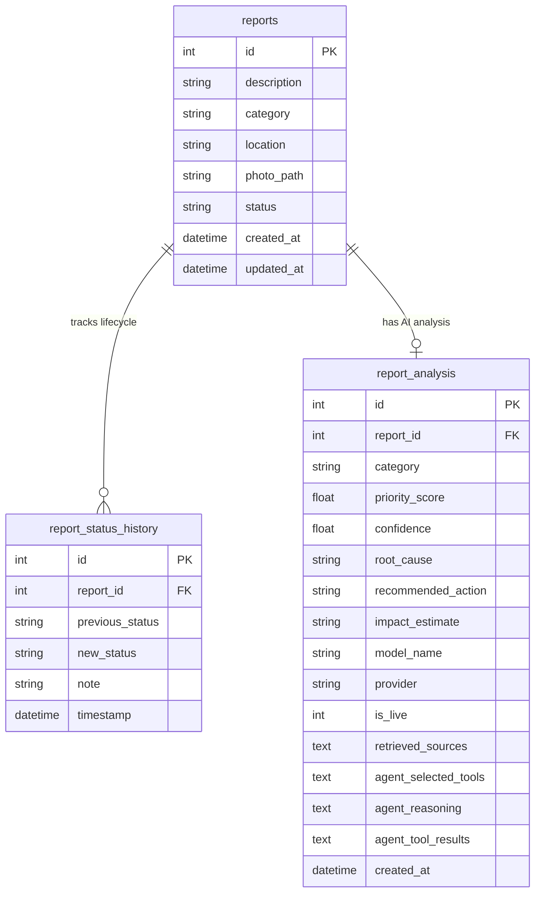

# Project Requirements & Specifications — AI Sustainability Discovery

This document details the functional and non-functional requirements, technical architecture, database schemas, environment configurations, and testing specifications for the **AI Sustainability Discovery Platform**.

---

## ⚙️ 1. Functional Requirements (FR)

### FR-1: Issue Reporting & Media Validation
- **FR-1.1:** The system shall provide a public issue submission form accessible without user registration.
- **FR-1.2:** The form shall require a text `description` and a valid `category`.
- **FR-1.3:** The form shall support optional `location` text and optional `photo` upload.
- **FR-1.4:** Photo uploads shall be restricted to JPG (`image/jpeg`) and PNG (`image/png`) formats under 5 MB in size.
- **FR-1.5:** Successfully uploaded photos shall be saved to `uploads/reports/` with unique UUID filenames.

### FR-2: RAG Knowledge Retrieval & Evidence Grounding
- **FR-2.1:** The system shall maintain an in-memory vector index (FAISS) over 9 sustainability domain markdown documents.
- **FR-2.2:** Vector search shall retrieve the top-3 most relevant context chunks using `sentence-transformers/all-MiniLM-L6-v2`.
- **FR-2.3:** Retrieved context shall display source filename, relevance match score %, section title, and excerpt snippet.
- **FR-2.4:** Campus survey observations shall be explicitly badged as `📋 Campus Survey Evidence`.

### FR-3: Autonomous ReAct AI Agent Analysis
- **FR-3.1:** The system shall provide an agentic analysis endpoint (`/api/reports/{id}/agent-analyze`).
- **FR-3.2:** The agent shall dynamically select and execute tools (`get_report`, `retrieve_knowledge`, `get_report_history`, `get_dashboard_stats`).
- **FR-3.3:** Analysis output shall include Priority Score (1.0-10.0), Confidence rating (0-100%), Root Cause, Recommended Action, and Qualitative Impact Estimate.
- **FR-3.4:** Agent reasoning trace, selected tools, and tool execution results shall be recorded and rendered in the UI.

### FR-4: Administrative Status Management
- **FR-4.1:** The admin panel ([`/admin`](http://localhost:3000/admin)) shall display a searchable, filterable table of all reports.
- **FR-4.2:** Admin users shall be able to update a report's status across 6 lifecycle stages:
  `submitted` $\rightarrow$ `under_review` $\rightarrow$ `action_planned` $\rightarrow$ `in_progress` $\rightarrow$ `resolved` $\rightarrow$ `verified`.
- **FR-4.3:** Admin users shall be able to append custom audit notes during status transitions.

### FR-5: Status Audit Trail & History
- **FR-5.1:** Every status transition shall create an immutable audit record in `report_status_history`.
- **FR-5.2:** The report detail page shall display the chronological status timeline with timestamps and inspector notes.

### FR-6: Impact Analytics Dashboard
- **FR-6.1:** The platform shall provide a real-time analytics dashboard ([`/dashboard`](http://localhost:3000/dashboard)).
- **FR-6.2:** Dashboard metrics (total reports, status breakdown, category breakdown, resolution rate %) shall be calculated directly from SQLite database records.

---

## 🛡️ 2. Non-Functional Requirements (NFR)

### NFR-1: Performance & Latency
- Vector similarity search latency shall not exceed **50ms**.
- API root endpoints shall respond within **100ms**.
- Page load time for frontend routes shall be under **1.5 seconds**.

### NFR-2: Reliability & Fault Tolerance
- The system shall implement a 3-tier AI provider fallback (`Google Gemini` $\rightarrow$ `IBM watsonx` $\rightarrow$ `Local RAG Simulation`).
- In the absence of cloud API keys, the system shall maintain **100% operational functionality** via local simulation.

### NFR-3: Security & Data Integrity
- User file uploads shall undergo strict MIME-type and file extension validation.
- SQL queries shall use SQLAlchemy ORM parameter binding to prevent SQL injection.
- API keys shall be stored in `.env` files and excluded from source control.

### NFR-4: Usability & Accessibility
- The frontend UI shall follow modern glassmorphic, dark-mode design standards using Tailwind CSS and Lucide icons.
- All interactive elements shall feature distinct hover states, ARIA roles, and high contrast ratios.

---

## 🗄️ 3. Database Schema Specifications

The platform uses SQLite managed via SQLAlchemy ORM (`Backend/app/models/`).



---

## 💻 4. Hardware & Software Prerequisites

- **Node.js:** v18.0.0 or higher
- **Python:** v3.10.0 or higher
- **Memory:** Minimum 4 GB RAM (8 GB recommended for sentence-transformers in-memory vector index)
- **Disk Space:** 500 MB free space

---

## 🔑 5. Environment Variables Reference

### Backend Configuration (`Backend/.env`)
```env
# Server Port & Mode
PORT=8000
DEBUG=True

# Google Gemini API Key (Optional — triggers Tier 1 AI generation)
GEMINI_API_KEY=your_gemini_api_key_here

# IBM watsonx Configuration (Optional — triggers Tier 2 AI generation)
WATSONX_APIKEY=your_watsonx_key_here
WATSONX_PROJECT_ID=your_project_id_here
WATSONX_URL=https://us-south.ml.cloud.ibm.com
```

### Frontend Configuration (`frontend/.env.local`)
```env
NEXT_PUBLIC_API_URL=http://localhost:8000
```

---

## 🧪 6. Automated Testing & Verification

The backend includes a comprehensive `pytest` test suite located in `Backend/tests/`:

```bash
cd Backend
python -m pytest tests/ -v
```

### Test Coverage Highlights (20 Automated Tests)
- `test_reports.py`: Creation, validation, status updates, invalid input rejection.
- `test_rag.py`: FAISS vector retrieval accuracy, campus survey grounding.
- `test_agent.py`: Tool selection, execution logging, status non-mutation rules.
- `test_ai_service.py`: Provider fallback pipeline, structured JSON parsing.
